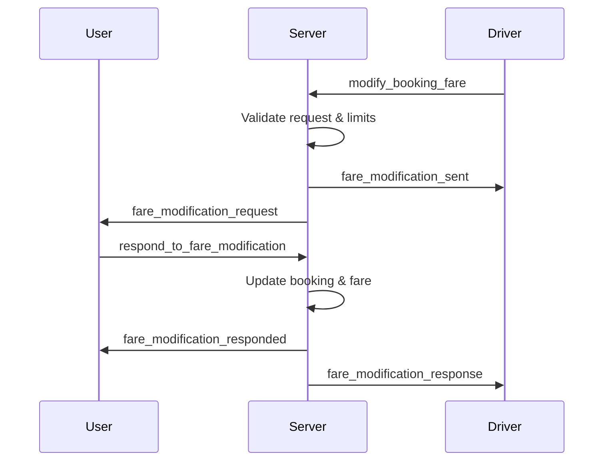

# Ride Booking API Guide

This guide covers the essential APIs for implementing ride booking functionality in your application.

## Table of Contents
1. [Authentication & Connection](#authentication--connection)
2. [Socket.IO Connection & Disconnection](#socketio-connection--disconnection)
3. [Live Location Tracking](#live-location-tracking)
4. [Fare Estimation with Qualified Drivers](#fare-estimation-with-qualified-drivers)
5. [Fare Adjustment](#fare-adjustment)
6. [Fare Modification & Negotiation](#fare-modification--negotiation)
   - [User-Initiated Fare Increase & Resend](#user-initiated-fare-increase--resend)
7. [Booking Creation & Driver Notification Process](#booking-creation--driver-notification-process)
8. [Booking Creation API](#booking-creation-api)
9. [Real-time Booking Flow](#real-time-booking-flow)
10. [Admin Pricing Configuration](#admin-pricing-configuration)

---

## 1. Authentication & Connection

### User Registration/Login

#### Register User
```http
POST /api/user/signup
Content-Type: application/json

{
  "username": "johndoe",
  "firstName": "John",
  "lastName": "Doe",
  "email": "john@example.com",
  "phoneNumber": "+1234567890",
  "password": "password123",
  "gender": "male"
}
```

#### Login User
```http
POST /api/user/login
Content-Type: application/json

{
  "email": "john@example.com",
  "password": "password123"
}
```

**Response:**
```json
{
  "success": true,
  "token": "jwt_token_here",
  "user": {
    "_id": "user_id",
    "username": "johndoe",
    "firstName": "John",
    "lastName": "Doe",
    "email": "john@example.com",
    "phoneNumber": "+1234567890",
    "gender": "male",
    "hasVehicle": null,
    "tgp": 0,
    "pgp": 0
  }
}
```

#### Set Vehicle Ownership
```http
POST /api/user/set-vehicle-ownership
Authorization: Bearer jwt_token
Content-Type: application/json

{
  "hasVehicle": "yes" // "yes" or "no"
}
```

**Response:**
```json
{
  "success": true,
  "message": "Vehicle ownership status updated successfully",
  "hasVehicle": "yes"
}
```

---

## 2. Socket.IO Connection & Disconnection

### Initial Connection

#### Connect to Socket.IO Server
```javascript
// Connect to Socket.IO with authentication
const socket = io('http://localhost:3001', {
  auth: { token: 'your_jwt_token_here' },
  transports: ['websocket', 'polling']
});
```

### Why REST-First Approach?

**Benefits:**
- **Robust Validation**: Complete field validation and business logic
- **Data Consistency**: Ensures all booking data is properly structured
- **Error Handling**: Comprehensive error responses and validation messages
- **Reliability**: Persistent storage with automatic real-time operations
- **Flexibility**: Can work without Socket.IO connection (booking still created)
- **Simplified Integration**: Single API call handles both booking creation and driver matching
- **Automatic Processing**: No additional steps required for real-time functionality

**Data Consistency Requirements:**
Both REST API and Socket.IO must use identical data structures:

```javascript
// Required fields for both approaches
{
  pickupLocation: {
    coordinates: [longitude, latitude],
    address: "string",
    zone: "string"
  },
  dropoffLocation: {
    coordinates: [longitude, latitude], 
    address: "string",
    zone: "string"
  },
  serviceType: "car cab" | "bike" | "car recovery" | "shifting & movers",
  serviceCategory: "string", // Service-specific categories
  vehicleType: "string",     // Service-specific vehicle types
  offeredFare: number,
  distanceInMeters: number,
  paymentMethod: "cash" | "card" | "wallet",
  
  // Optional enhanced fields
  passengerCount: number,
  driverFilters: object,
  serviceDetails: object,
  appointmentDetails: object,
  itemDetails: array,
  serviceOptions: object,
  pinkCaptainOptions: object
}

// Listen for authentication success
socket.on('authenticated', (data) => {
  console.log('Authenticated:', data.user);
});

// Handle connection events
socket.on('connect', () => {
  console.log('Connected to server');
});

socket.on('disconnect', () => {
  console.log('Disconnected from server');
});

// Handle socket errors
socket.on('error', (error) => {
  console.error('Socket error:', error);
});
```

### User Connection (Customer)

#### Join User Room
```javascript
// For customers - join user room
socket.emit('join_user_room', userId);

// Listen for room joined confirmation
socket.on('room_joined', (data) => {
  console.log('Joined room:', data.room);
});
```

#### User Location Updates
```javascript
// Update user location
socket.emit('user_location_update', {
  coordinates: [longitude, latitude],
  address: 'Current address',
  bookingId: 'booking_id' // optional, for active rides
});

// Update location during booking search
socket.emit('update_location', {
  coordinates: [77.2090, 28.6139]
});
```

### Driver Connection

#### Join Driver Room
```javascript
// For drivers - join driver room
socket.emit('join_driver_room', driverId);

// Listen for room joined confirmation
socket.on('room_joined', (data) => {
  console.log('Joined driver room:', data.room);
});
```

#### Driver Location Updates
```javascript
// Driver location update
socket.emit('driver_location_update', {
  coordinates: [longitude, latitude],
  address: 'Current address',
  heading: 45, // degrees
  speed: 30 // km/h
});
```

#### Driver Auto-Accept Settings
```javascript
// Update auto-accept settings
socket.emit('update_auto_accept_settings', {
  enabled: true,
  maxDistance: 5, // km
  minFare: 100,
  serviceTypes: ['car cab', 'bike']
});
```

### Disconnection

#### Graceful Disconnection
```javascript
// Disconnect from socket
socket.disconnect();

// Listen for disconnection
socket.on('disconnect', (reason) => {
  console.log('Disconnected:', reason);
  // Handle reconnection logic if needed
});
```

---

## 3. Live Location Tracking

### Real-time Location Updates

The system supports comprehensive live location tracking for both customers and drivers using Socket.IO for real-time communication.

#### Customer Location Tracking

##### Update Customer Location
```javascript
// Update customer location during ride search or active booking
socket.emit('user_location_update', {
  coordinates: [longitude, latitude],
  address: 'Current address string',
  bookingId: 'booking_id_if_active' // Optional: include for active rides
});

// Listen for location update confirmation
socket.on('location_updated', (data) => {
  console.log('Location updated:', data);
});
```

##### Continuous Location Updates
```javascript
// For continuous tracking during ride search
socket.emit('update_location', {
  coordinates: [longitude, latitude]
});
```

#### Driver Location Tracking

##### Update Driver Location
```javascript
// Comprehensive driver location update
socket.emit('driver_location_update', {
  coordinates: [longitude, latitude],
  address: 'Current driver address',
  heading: 45,        // Direction in degrees (0-360)
  speed: 30,          // Speed in km/h
  accuracy: 5,        // GPS accuracy in meters
  timestamp: Date.now()
});

// Listen for driver location update confirmation
socket.on('driver_location_updated', (data) => {
  console.log('Driver location updated:', data);
});
```

##### Driver Status Updates
```javascript
// Update driver availability status
socket.emit('driver_status_update', {
  status: 'available', // 'available', 'busy', 'offline'
  coordinates: [longitude, latitude]
});
```

#### Location Broadcasting

##### Customer Receives Driver Location
```javascript
// Listen for nearby driver locations during search
socket.on('nearby_drivers', (drivers) => {
  drivers.forEach(driver => {
    console.log('Driver:', {
      id: driver._id,
      name: driver.firstName + ' ' + driver.lastName,
      location: driver.currentLocation,
      distance: driver.distance,
      vehicleType: driver.vehicleType,
      rating: driver.rating
    });
  });
});

// Listen for assigned driver location updates during active ride
socket.on('driver_location_update', (locationData) => {
  console.log('Driver location update:', {
    coordinates: locationData.coordinates,
    address: locationData.address,
    heading: locationData.heading,
    speed: locationData.speed,
    estimatedArrival: locationData.estimatedArrival
  });
});
```

##### Driver Receives Customer Location
```javascript
// Listen for customer location updates during active ride
socket.on('customer_location_update', (locationData) => {
  console.log('Customer location:', {
    coordinates: locationData.coordinates,
    address: locationData.address,
    bookingId: locationData.bookingId
  });
});
```

#### Location Data Structure

##### Standard Location Object
```javascript
{
  coordinates: [longitude, latitude], // [Number, Number]
  address: "Street address string",   // String
  lastUpdated: "2024-01-15T10:30:00Z", // ISO timestamp
  accuracy: 5,                        // GPS accuracy in meters
  heading: 45,                        // Direction (drivers only)
  speed: 30                           // Speed in km/h (drivers only)
}
```

##### Driver Location Response
```javascript
{
  _id: "driver_id",
  firstName: "John",
  lastName: "Doe",
  currentLocation: {
    coordinates: [77.2090, 28.6139],
    address: "Connaught Place, New Delhi",
    lastUpdated: "2024-01-15T10:30:00Z"
  },
  vehicleType: "sedan",
  vehicleDetails: {
    make: "Toyota",
    model: "Camry",
    plateNumber: "DL01AB1234",
    color: "white"
  },
  rating: 4.8,
  totalRides: 1250,
  distance: 2.5,              // Distance from customer in km
  estimatedArrival: "8 mins"  // Estimated arrival time
}
```

#### Location Privacy & Security

##### Location Sharing Controls
```javascript
// Enable/disable location sharing
socket.emit('toggle_location_sharing', {
  enabled: true,
  shareWithCustomers: true,  // For drivers
  shareWithDrivers: true     // For customers
});
```

##### Location History
```javascript
// Request location history (for analytics/support)
socket.emit('get_location_history', {
  bookingId: 'booking_id',
  startTime: '2024-01-15T00:00:00Z',
  endTime: '2024-01-15T23:59:59Z'
});

socket.on('location_history', (history) => {
  console.log('Location history:', history);
});
```

---

## 4. Fare Estimation with Qualified Drivers

The fare estimation system supports multiple service categories with different pricing models:

### Service Types:
1. **Car Cab** - Traditional taxi service with vehicle type variations
2. **Bike** - Motorcycle taxi service
3. **Car Recovery** - Towing and roadside assistance services
4. **Shifting & Movers** - Furniture moving with item-based and floor-based pricing

### 3.1 Car Cab Fare Estimation

```http
POST /api/fare/estimate-fare
Authorization: Bearer jwt_token
Content-Type: application/json

{
  "pickupLocation": {
    "coordinates": [77.2090, 28.6139],
    "address": "Connaught Place, New Delhi"
  },
  "dropoffLocation": {
    "coordinates": [77.3910, 28.5355],
    "address": "Noida Sector 62"
  },
  "serviceType": "car cab",
  "serviceCategory": "standard",
  "vehicleType": "economy", // "economy", "premium", "luxury", "xl", "family"
  "routeType": "one_way", // "one_way" or "round_trip"
  "distanceInMeters": 12500,
  "estimatedDuration": 25, // minutes
  "trafficCondition": "moderate", // "light", "moderate", "heavy"
  "isNightTime": false, // true for night surcharge (10 PM - 6 AM)
  "demandRatio": 1.2, // surge pricing multiplier
  "waitingMinutes": 0, // expected waiting time
  "scheduledTime": null, // ISO string for future bookings
  "paymentMethod": "cash" // "cash", "card", "wallet", "upi"
}
```

### 3.2 Bike Fare Estimation

```http
POST /api/fare/estimate-fare
Authorization: Bearer jwt_token
Content-Type: application/json

{
  "pickupLocation": {
    "coordinates": [77.2090, 28.6139],
    "address": "Connaught Place, New Delhi"
  },
  "dropoffLocation": {
    "coordinates": [77.3910, 28.5355],
    "address": "Noida Sector 62"
  },
  "serviceType": "bike",
  "vehicleType": "standard", // "standard", "electric"
  "routeType": "one_way", // "one_way" or "round_trip"
  "distanceInMeters": 12500,
  "estimatedDuration": 20, // minutes
  "trafficCondition": "light", // "light", "moderate", "heavy"
  "isNightTime": false, // true for night surcharge (10 PM - 6 AM)
  "demandRatio": 1.0, // surge pricing multiplier
  "waitingMinutes": 0, // expected waiting time
  "scheduledTime": null, // ISO string for future bookings
  "paymentMethod": "cash" // "cash", "card", "wallet", "upi"
}
```

### 3.3 Car Recovery Fare Estimation

```http
POST /api/fare/estimate-fare
Authorization: Bearer jwt_token
Content-Type: application/json

{
  "pickupLocation": {
    "coordinates": [55.2708, 25.2048],
    "address": "Dubai Mall, Dubai"
  },
  "dropoffLocation": {
    "coordinates": [55.1394, 25.0657],
    "address": "Dubai International Airport"
  },
  "serviceType": "car recovery",
  "serviceCategory": "flatbed towing", // "flatbed towing", "wheel lift towing", "jumpstart service"
  "vehicleType": "flatbed", // "tow_truck", "flatbed"
  "routeType": "one_way",
  "distanceInMeters": 15000,
  "serviceDetails": {
    "vehicleCondition": "not_starting", // "running", "not_running", "accident", "not_starting"
    "recoveryType": "breakdown", // "breakdown", "accident", "fuel_delivery", "battery_jump"
    "urgencyLevel": "normal", // "normal", "urgent", "emergency"
    "vehicleModel": "Toyota Camry",
    "vehicleYear": 2020
  },
  "paymentMethod": "cash"
}
```

### 3.4 Shifting & Movers Fare Estimation

```http
POST /api/fare/estimate-fare
Authorization: Bearer jwt_token
Content-Type: application/json

{
  "pickupLocation": {
    "coordinates": [55.2708, 25.2048],
    "address": "Dubai Mall, Dubai"
  },
  "dropoffLocation": {
    "coordinates": [55.1394, 25.0657],
    "address": "Dubai International Airport"
  },
  "serviceType": "shifting & movers",
  "vehicleType": "small_truck", // "small_truck", "medium_truck", "large_truck"
  "routeType": "one_way",
  "distanceInMeters": 15000,
  "itemDetails": [
    {
      "category": "furniture",
      "items": {
        "bed": 2,
        "sofa": 1,
        "dining_table": 1,
        "wardrobe": 1
      }
    },
    {
      "category": "appliances",
      "items": {
        "fridge": 1,
        "washing_machine": 1,
        "tv": 1
      }
    }
  ],
  "extras": [
    {
      "name": "custom_box",
      "count": 5
    },
    {
      "name": "fragile_items",
      "count": 3
    }
  ],
  "serviceDetails": {
    "shiftingMovers": {
      "selectedServices": {
        "loadingUnloading": true,
        "packing": true,
        "fixing": false,
        "helpers": true,
        "wheelchairHelper": false
      },
      "pickupFloorDetails": {
        "floor": 3,
        "accessType": "stairs", // "stairs", "lift", "ground"
        "hasLift": false
      },
      "dropoffFloorDetails": {
        "floor": 2,
        "accessType": "lift", // "stairs", "lift", "ground"
        "hasLift": true
      }
    }
  },
  "serviceOptions": {
    "packingMaterial": true,
    "disassemblyService": true,
    "storageService": false,
    "insuranceCoverage": true
  },
  "paymentMethod": "cash"
}
```

### Fare Estimation Response Examples

#### Car Cab Response:
```json
{
  "success": true,
  "estimatedFare": 245.50,
  "currency": "AED",
  "fareBreakdown": {
    "baseFare": 50,
    "distanceFare": 125,
    "timeFare": 25,
    "trafficSurcharge": 15,
    "nightSurcharge": 0,
    "surgePricing": 30.50,
    "serviceCharges": 0,
    "taxes": 0
  },
  "adjustmentSettings": {
    "allowedPercentage": 20,
    "minFare": 196.40,
    "maxFare": 294.60,
    "canAdjustFare": true
  },
  "tripDetails": {
    "distance": "12.50 km",
    "estimatedDuration": "25 mins",
    "serviceType": "car cab",
    "serviceCategory": "standard",
    "vehicleType": "economy",
    "routeType": "one_way",
    "trafficCondition": "moderate",
    "isNightTime": false,
    "demandRatio": 1.2
  },
  "qualifiedDrivers": [
    {
      "_id": "driver_id_1",
      "firstName": "Ahmed",
      "lastName": "Hassan",
      "email": "ahmed.hassan@example.com",
      "phoneNumber": "+971501234567",
      "vehicleType": "economy",
      "currentLocation": {
        "coordinates": [77.2095, 28.6145],
        "address": "Near Connaught Place Metro Station",
        "lastUpdated": "2024-01-15T10:28:00Z"
      },
      "vehicleDetails": {
        "make": "Toyota",
        "model": "Corolla",
        "plateNumber": "DL01AB1234",
        "color": "white",
        "year": 2022
      },
      "profilePicture": "https://example.com/profiles/ahmed.jpg",
      "rating": 4.8,
      "totalRides": 1250,
      "gender": "male",
      "distance": 0.8,
      "estimatedArrival": "3 mins"
    },
    {
      "_id": "driver_id_2",
      "firstName": "Fatima",
      "lastName": "Al-Zahra",
      "email": "fatima.alzahra@example.com",
      "phoneNumber": "+971507654321",
      "vehicleType": "economy",
      "currentLocation": {
        "coordinates": [77.2110, 28.6120],
        "address": "Janpath Road",
        "lastUpdated": "2024-01-15T10:29:00Z"
      },
      "vehicleDetails": {
        "make": "Nissan",
        "model": "Sunny",
        "plateNumber": "DL02CD5678",
        "color": "silver",
        "year": 2021
      },
      "profilePicture": "https://example.com/profiles/fatima.jpg",
      "rating": 4.9,
      "totalRides": 890,
      "gender": "female",
      "distance": 1.2,
      "estimatedArrival": "4 mins"
    }
  ],
  "driversCount": 8
}
```

#### Shifting & Movers Response:
```json
{
  "success": true,
  "estimatedFare": 285.75,
  "currency": "AED",
  "fareBreakdown": {
    "baseFare": 100.00,
    "distanceFare": 75.00,
    "serviceFees": {
      "loadingUnloading": 40.00,
      "packing": 35.00,
      "fixing": 0.00,
      "helpers": 20.00
    },
    "locationCharges": {
      "pickup": {
        "floor": 3,
        "accessType": "stairs",
        "stairsCharges": 24.00,
        "liftCharges": 0.00,
        "calculation": "2 beds × 4 AED/floor × 3 floors + 1 sofa × 3 AED/floor × 3 floors + others"
      },
      "dropoff": {
        "floor": 2,
        "accessType": "lift",
        "stairsCharges": 0.00,
        "liftCharges": 8.00,
        "calculation": "2 beds × 2 AED/item + 1 sofa × 1.5 AED/item + others"
      }
    },
    "itemCharges": {
      "bed": {
        "quantity": 2,
        "unitPrice": 15.00,
        "total": 30.00
      },
      "sofa": {
        "quantity": 1,
        "unitPrice": 15.00,
        "total": 15.00
      },
      "fridge": {
        "quantity": 1,
        "unitPrice": 25.00,
        "total": 25.00
      },
      "dining_table": {
        "quantity": 1,
        "unitPrice": 20.00,
        "total": 20.00
      }
    },
    "extrasItems": {
      "custom_box": {
        "quantity": 5,
        "unitPrice": 0.00,
        "total": 0.00,
        "note": "No cost - user-defined item"
      },
      "fragile_items": {
        "quantity": 3,
        "unitPrice": 0.00,
        "total": 0.00,
        "note": "No cost - user-defined item"
      }
    },
    "platformCharges": {
      "percentage": 15,
      "amount": 18.75
    }
  },
  "floorPricingDetails": {
    "pickupFloorDetails": {
      "floor": 3,
      "extraFloors": 3,
      "accessType": "stairs",
      "baseCoverageFloors": 0
    },
    "dropoffFloorDetails": {
      "floor": 2,
      "extraFloors": 2,
      "accessType": "lift",
      "baseCoverageFloors": 0
    }
  },
  "adjustmentSettings": {
    "allowedPercentage": 15,
    "minFare": 242.89,
    "maxFare": 328.61,
    "canAdjustFare": true
  },
  "tripDetails": {
     "distance": "15.00 km",
     "estimatedDuration": "45 mins",
     "serviceType": "shifting & movers",
     "vehicleType": "small_truck",
     "routeType": "one_way",
     "totalItems": 5,
     "totalExtras": 8,
     "servicesIncluded": ["loadingUnloading", "packing", "helpers"],
     "note": "Extras items (custom_box, fragile_items) have no additional cost"
   }
}
```

### Qualified Drivers Data

The fare estimation API now returns comprehensive information about qualified drivers in the area, including their live locations, vehicle details, and ratings. This enables customers to see available drivers before booking.

#### Driver Qualification Criteria

- **Role**: Must be a verified driver
- **KYC Status**: Must have completed KYC verification
- **Activity Status**: Must be currently active and available
- **Location**: Must be within service radius (10km for general services, 50km for Pink Captain)
- **Vehicle Type**: Must match the requested service and vehicle type
- **Gender Filtering**: For Pink Captain service, only female drivers are included

#### Driver Data Structure

Each qualified driver object includes:

```javascript
{
  "_id": "unique_driver_id",
  "firstName": "Driver first name",
  "lastName": "Driver last name",
  "email": "driver@example.com",
  "phoneNumber": "+971501234567",
  "vehicleType": "economy|premium|luxury|xl|family",
  "currentLocation": {
    "coordinates": [longitude, latitude],
    "address": "Current driver address",
    "lastUpdated": "ISO timestamp"
  },
  "vehicleDetails": {
    "make": "Vehicle manufacturer",
    "model": "Vehicle model",
    "plateNumber": "License plate",
    "color": "Vehicle color",
    "year": 2022
  },
  "profilePicture": "URL to driver photo",
  "rating": 4.8,              // Average rating (0-5)
  "totalRides": 1250,         // Total completed rides
  "gender": "male|female",
  "distance": 0.8,            // Distance from pickup in km
  "estimatedArrival": "3 mins" // Estimated arrival time
}
```

#### Pink Captain Service

For Pink Captain service requests, the system:
- Filters drivers by gender (female only)
- Checks `driverSettings.ridePreferences.pinkCaptainMode` is enabled
- Uses extended search radius (50km vs 10km)
- Prioritizes drivers with Pink Captain experience

#### Driver Sorting & Limits

- Drivers are sorted by distance from pickup location (closest first)
- Maximum of 10 qualified drivers returned per request
- Real-time location data ensures accuracy
- Includes estimated arrival time based on current traffic

---

## 5. Fare Adjustment

After getting the fare estimation, users can adjust the fare within admin-configured limits for all service types.

### 5.1 Car Cab Fare Adjustment

```http
POST /api/fare/adjust-fare
Authorization: Bearer jwt_token
Content-Type: application/json

{
  "originalFare": 245.50,
  "adjustedFare": 260.00,
  "serviceType": "car cab"
}
```

**Response:**
```json
{
  "success": true,
  "message": "Fare adjustment validated successfully",
  "data": {
    "originalFare": 245.50,
    "adjustedFare": 260.00,
    "adjustmentAmount": 14.50,
    "adjustmentPercentage": 5.91,
    "currency": "AED"
  },
  "token": "jwt_token_here"
}
```

### 5.2 Bike Fare Adjustment

```http
POST /api/fare/adjust-fare
Authorization: Bearer jwt_token
Content-Type: application/json

{
  "originalFare": 85.00,
  "adjustedFare": 95.00,
  "serviceType": "bike"
}
```

**Response:**
```json
{
  "success": true,
  "message": "Fare adjustment validated successfully",
  "data": {
    "originalFare": 85.00,
    "adjustedFare": 95.00,
    "adjustmentAmount": 10.00,
    "adjustmentPercentage": 11.76,
    "currency": "AED"
  },
  "token": "jwt_token_here"
}
```

### 5.3 Car Recovery Fare Adjustment

```http
POST /api/fare/adjust-fare
Authorization: Bearer jwt_token
Content-Type: application/json

{
  "originalFare": 450.00,
  "adjustedFare": 500.00,
  "serviceType": "car recovery"
}
```

**Response:**
```json
{
  "success": true,
  "message": "Fare adjustment validated successfully",
  "data": {
    "originalFare": 450.00,
    "adjustedFare": 500.00,
    "adjustmentAmount": 50.00,
    "adjustmentPercentage": 11.11,
    "currency": "AED"
  },
  "token": "jwt_token_here"
}
```

### 5.4 Shifting & Movers Fare Adjustment

```http
POST /api/fare/adjust-fare
Authorization: Bearer jwt_token
Content-Type: application/json

{
  "originalFare": 285.75,
  "adjustedFare": 320.00,
  "serviceType": "shifting & movers"
}
```

**Response:**
```json
{
  "success": true,
  "message": "Fare adjustment validated successfully",
  "data": {
    "originalFare": 285.75,
    "adjustedFare": 320.00,
    "adjustmentAmount": 34.25,
    "adjustmentPercentage": 11.98,
    "currency": "AED"
  },
  "token": "jwt_token_here"
}
```

### Error Responses

**Error Response (if adjustment exceeds limits):**
```json
{
  "success": false,
  "message": "Adjusted fare must be between 196.40 and 294.60 AED (±20% of original fare)",
  "token": "jwt_token_here"
}
```

**Error Response (if fare adjustment disabled):**
 ```json
 {
   "success": false,
   "message": "Fare adjustment is currently disabled by admin",
   "token": "jwt_token_here"
 }
 ```

**Error Response (invalid service type):**
 ```json
 {
   "success": false,
   "message": "Invalid service type. Supported services: car cab, bike, car recovery, shifting & movers",
   "token": "jwt_token_here"
 }
 ```

### Fare Adjustment Rules

#### General Rules
- **Default Adjustment Limit**: 3% (configurable by admin, max 50%)
- **Validation**: Adjusted fare must be within min/max bounds
- **Admin Control**: Admins can enable/disable user fare adjustment
- **Service-Specific**: Different limits can be set for different service types
- **Required Fields**: `originalFare`, `adjustedFare`, and `serviceType` are mandatory
- **Authentication**: Requires valid JWT token in Authorization header

#### Service-Specific Adjustment Limits

| Service Type | Default Limit | Typical Range | Notes |
|--------------|---------------|---------------|---------|
| **Car Cab** | 20% | ±15-25% | Higher flexibility for surge pricing scenarios |
| **Bike** | 15% | ±10-20% | Moderate adjustment for quick rides |
| **Car Recovery** | 25% | ±20-30% | Higher limits due to emergency nature and variable conditions |
| **Shifting & Movers** | 15% | ±10-20% | Limited adjustment due to item-based pricing complexity |

#### Adjustment Scenarios

**Car Cab Adjustments:**
- Surge pricing negotiations
- Traffic condition changes
- Route preference adjustments
- Premium service upgrades

**Bike Adjustments:**
- Weather condition premiums
- Rush hour negotiations
- Short distance minimum fare adjustments

**Car Recovery Adjustments:**
- Emergency service premiums
- After-hours surcharges
- Complex recovery situation adjustments
- Distance-based towing rate negotiations

**Shifting & Movers Adjustments:**
- Additional helper requirements
- Extra packing material costs
- Floor access difficulty adjustments
- Heavy item handling premiums

### Usage Notes

1. **Get Adjustment Limits**: The fare estimation response includes `adjustmentSettings` with allowed percentage and min/max fare bounds
2. **Validate Before Booking**: Always call this endpoint to validate fare adjustment before creating a booking
3. **Error Handling**: Handle both validation errors (exceeds limits) and configuration errors (adjustment disabled)
4. **Currency**: All fare amounts are in AED (Arab Emirates Dirham)
5. **Precision**: Fare amounts are rounded to 2 decimal places
6. **Service Validation**: Ensure the `serviceType` matches one of the four supported services
7. **Real-time Limits**: Adjustment limits may change based on admin configuration and market conditions

---

## 6. Fare Modification & Negotiation

The fare modification system allows drivers to propose fare changes during the booking process, enabling real-time negotiation between drivers and users. This feature provides flexibility for dynamic pricing based on traffic conditions, demand, or service complexity.

### 5.1 Overview

Fare modification is a post-booking feature that allows:
- **Drivers**: To propose fare increases or decreases within admin-configured limits
- **Users**: To accept or reject proposed fare modifications
- **System**: To track modification history and enforce business rules

### 5.2 Driver-Initiated Fare Modification

#### Socket Event: `modify_booking_fare`

Drivers can propose fare modifications for accepted bookings using this Socket.IO event.

**Event Parameters:**
```javascript
socket.emit('modify_booking_fare', {
  requestId: 'booking_id_here',     // Required: Booking ID
  newFare: 250.00,                 // Required: Proposed new fare amount
  reason: 'Traffic conditions'      // Optional: Reason for modification
});
```

**Validation Rules:**
- Only drivers can initiate fare modifications
- Booking must be in 'accepted' status
- New fare must be within admin-configured adjustment limits
- Driver must be assigned to the booking

**Success Response:**
```javascript
socket.on('fare_modification_sent', (data) => {
  console.log('Modification request sent:', data);
  // {
  //   success: true,
  //   requestId: 'booking_id',
  //   message: 'Fare modification request sent to user',
  //   newFare: 250.00
  // }
});
```

**Error Response:**
```javascript
socket.on('booking_error', (error) => {
  console.log('Modification failed:', error.message);
  // Possible errors:
  // - "Only drivers can modify fare"
  // - "Booking not found or not assigned to you"
  // - "Booking must be accepted to modify fare"
  // - "New fare exceeds allowed adjustment limits"
});
```

### 5.3 User Response to Fare Modification

#### Socket Event: `respond_to_fare_modification`

Users receive fare modification requests and can accept or reject them.

**User Receives Modification Request:**
```javascript
socket.on('fare_modification_request', (data) => {
  console.log('Driver requested fare change:', data);
  // {
  //   requestId: 'booking_id',
  //   originalFare: 200.00,
  //   newFare: 250.00,
  //   reason: 'Traffic conditions',
  //   driverName: 'John Doe',
  //   requestedAt: '2024-01-15T10:30:00Z'
  // }
  
  // Show user acceptance/rejection UI
});
```

**User Response Event:**
```javascript
socket.emit('respond_to_fare_modification', {
  requestId: 'booking_id_here',     // Required: Booking ID
  response: 'accepted',             // Required: 'accepted' or 'rejected'
  reason: 'Agreed to new fare'      // Optional: Reason for response
});
```

**Success Response:**
```javascript
socket.on('fare_modification_responded', (data) => {
  console.log('Response sent:', data);
  // {
  //   success: true,
  //   requestId: 'booking_id',
  //   message: 'Fare modification accepted successfully and ride started!',
  //   finalFare: 250.00,
  //   rideStarted: true  // Indicates if ride was automatically started
  // }
});

// If fare was accepted, user will also receive ride start notification
socket.on('ride_started', (data) => {
  console.log('Ride started after fare acceptance:', data);
  // {
  //   bookingId: 'booking_id',
  //   message: 'Your ride has started after fare acceptance!',
  //   status: 'started',
  //   startedAt: '2024-01-15T10:36:00Z',
  //   driver: {
  //     id: 'driver_id',
  //     name: 'John Doe',
  //     phone: '+1234567890'
  //   }
  // }
});
```

### 5.4 Driver Receives User Response

```javascript
socket.on('fare_modification_response', (data) => {
  console.log('User responded to fare modification:', data);
  // {
  //   requestId: 'booking_id',
  //   response: 'accepted',
  //   reason: 'Agreed to new fare',
  //   finalFare: 250.00,
  //   respondedAt: '2024-01-15T10:35:00Z',
  //   rideStarted: true  // Indicates if ride was automatically started
  // }
  
  if (data.response === 'accepted') {
    if (data.rideStarted) {
      // Ride has automatically started - no need to manually start
      console.log('Ride started automatically after fare acceptance');
    } else {
      // Proceed with booking at new fare - may need to manually start ride
    }
  } else {
    // Continue with original fare or cancel
  }
});

// If fare was accepted, driver will also receive ride start notification
socket.on('ride_started', (data) => {
  console.log('Ride started after user accepted fare:', data);
  // {
  //   bookingId: 'booking_id',
  //   message: 'Ride started after user accepted your fare modification!',
  //   status: 'started',
  //   startedAt: '2024-01-15T10:36:00Z',
  //   user: {
  //     id: 'user_id',
  //     name: 'Jane Smith',
  //     phone: '+1234567890'
  //   }
  // }
});
```

### 5.5 Fare Modification Workflow



### 5.6 Business Rules & Validation

#### Adjustment Limits
- **Default Limit**: Configurable by admin (typically 20% for car cab, 15% for bike)
- **Service-Specific**: Different limits for different service types
- **Bidirectional**: Both increases and decreases are allowed within limits
- **Real-time**: Limits are fetched from `getFareAdjustmentSettings()` function

#### Status Requirements
- **Booking Status**: Must be 'accepted' to modify fare
- **Driver Assignment**: Only assigned driver can modify fare
- **User Authorization**: Only booking creator can respond to modifications
- **Single Request**: Only one pending modification per booking

#### Data Persistence
- **Modification History**: All requests stored in `fareModificationRequest` field
- **Timestamps**: Request and response times tracked
- **Audit Trail**: Complete modification history maintained
- **Final Fare**: Updated in booking document when accepted

### 5.7 Error Handling

#### Common Error Scenarios

**Driver Errors:**
```javascript
// Unauthorized modification attempt
{ message: "Only drivers can modify fare" }

// Invalid booking state
{ message: "Booking must be accepted to modify fare" }

// Fare limit exceeded
{ message: "New fare exceeds allowed adjustment limits" }

// Booking not found
{ message: "Booking not found or not assigned to you" }
```

**User Errors:**
```javascript
// Unauthorized response attempt
{ message: "Only users can respond to fare modifications" }

// No pending request
{ message: "No pending fare modification request found" }

// Invalid response format
{ message: "Response must be 'accepted' or 'rejected'" }
```

### 5.8 Integration Examples

#### Frontend Integration (React/Vue)

```javascript
// Driver component
const modifyFare = (bookingId, newFare, reason) => {
  socket.emit('modify_booking_fare', {
    requestId: bookingId,
    newFare: parseFloat(newFare),
    reason: reason
  });
};

// User component
const respondToModification = (bookingId, accepted, reason) => {
  socket.emit('respond_to_fare_modification', {
    requestId: bookingId,
    response: accepted ? 'accepted' : 'rejected',
    reason: reason
  });
};

// Event listeners
useEffect(() => {
  socket.on('fare_modification_request', handleModificationRequest);
  socket.on('fare_modification_response', handleModificationResponse);
  
  return () => {
    socket.off('fare_modification_request');
    socket.off('fare_modification_response');
  };
}, []);
```

#### Mobile Integration (React Native)

```javascript
// Driver modification request
const requestFareModification = async (bookingId, newFare) => {
  try {
    socket.emit('modify_booking_fare', {
      requestId: bookingId,
      newFare: newFare,
      reason: 'Traffic delay'
    });
    
    // Show loading state
    setModificationPending(true);
  } catch (error) {
    Alert.alert('Error', 'Failed to send modification request');
  }
};

// User response handling
const handleFareModification = (data) => {
  Alert.alert(
    'Fare Modification Request',
    `Driver requested to change fare from $${data.originalFare} to $${data.newFare}. Reason: ${data.reason}`,
    [
      {
        text: 'Reject',
        onPress: () => respondToModification(data.requestId, false)
      },
      {
        text: 'Accept',
        onPress: () => respondToModification(data.requestId, true)
      }
    ]
  );
};
```

### 5.9 User-Initiated Fare Increase & Resend

When no drivers respond to the initial booking request, users can increase the fare and resend the request to qualified drivers. This feature helps improve booking success rates during high-demand periods.

#### Socket Event: `increase_fare_and_resend`

Users can increase their fare and automatically resend the booking request to nearby drivers.

**Event Parameters:**
```javascript
socket.emit('increase_fare_and_resend', {
  bookingId: 'booking_id_here',     // Required: Booking ID
  newFare: 300.00,                 // Required: Increased fare amount
  reason: 'No drivers responding'   // Optional: Reason for increase
});
```

**Validation Rules:**
- Only users can increase their own booking fare
- Booking must be in 'pending' status
- New fare must be higher than current fare
- Maximum 50% increase per attempt allowed
- Maximum 3 resend attempts per booking
- Fare increase must be reasonable (not excessive)

**Success Response:**
```javascript
socket.on('fare_increased_and_resent', (data) => {
  console.log('Fare increased and resent:', data);
  // {
  //   bookingId: 'booking_id',
  //   originalFare: 200.00,
  //   newFare: 300.00,
  //   resendAttempt: 1,
  //   maxAttempts: 3,
  //   driversFound: 5,
  //   message: 'Fare increased to 300 AED and request resent to 5 drivers'
  // }
});
```

**Error Response:**
```javascript
socket.on('fare_increase_error', (error) => {
  console.log('Fare increase failed:', error.message);
  // Possible errors:
  // - "Booking ID and new fare are required"
  // - "Only users can increase fare"
  // - "Booking not found"
  // - "You can only modify your own bookings"
  // - "Can only increase fare for pending bookings"
  // - "Maximum resend attempts (3) reached"
  // - "New fare must be higher than current fare"
  // - "Fare increase too high. Maximum allowed: X AED"
  // - "Still no drivers available in your area. You can try increasing the fare again."
});
```

#### Driver Notification Enhancement

When a fare is increased and resent, drivers receive enhanced booking notifications:

```javascript
socket.on('new_booking_request', (data) => {
  console.log('Enhanced booking request:', data);
  // {
  //   requestId: 'booking_id',
  //   fare: 300.00,
  //   originalFare: 200.00,        // Original fare amount
  //   fareIncreased: true,         // Indicates fare was increased
  //   resendAttempt: 1,           // Current resend attempt number
  //   // ... other booking details
  // }
});
```

#### Business Logic

**Fare Increase Tracking:**
- Each fare increase is recorded in `userFareIncreases` array
- Tracks original fare, increased fare, reason, and timestamp
- Maintains resend attempt counter
- Records last resend timestamp

**Resend Logic:**
- Automatically finds qualified drivers using existing `findNearbyDrivers` function
- Applies same driver qualification criteria as initial booking
- Sends enhanced booking request with fare increase indicators
- Updates booking document with new fare and resend metadata

**Limits & Validation:**
- Maximum 3 resend attempts per booking (configurable)
- 50% maximum fare increase per attempt
- Only pending bookings can have fare increased
- User authorization validation

#### Integration Example

```javascript
// User component for fare increase
const increaseFareAndResend = (bookingId, currentFare) => {
  const suggestedIncrease = currentFare * 0.2; // 20% increase
  const newFare = currentFare + suggestedIncrease;
  
  socket.emit('increase_fare_and_resend', {
    bookingId: bookingId,
    newFare: newFare,
    reason: 'No drivers responding - increasing fare to attract drivers'
  });
};

// Event listeners
useEffect(() => {
  socket.on('fare_increased_and_resent', (data) => {
    setBookingFare(data.newFare);
    setResendAttempt(data.resendAttempt);
    showSuccessMessage(data.message);
  });
  
  socket.on('fare_increase_error', (error) => {
    showErrorMessage(error.message);
  });
  
  return () => {
    socket.off('fare_increased_and_resent');
    socket.off('fare_increase_error');
  };
}, []);
```

### 5.10 Best Practices

#### For Drivers
1. **Provide Clear Reasons**: Always include a reason for fare modifications
2. **Reasonable Adjustments**: Keep modifications within reasonable bounds
3. **Timely Requests**: Submit modifications promptly after accepting booking
4. **Communication**: Use in-app messaging to explain complex situations

#### For Users
1. **Quick Response**: Respond to modification requests promptly
2. **Consider Context**: Factor in traffic, weather, and service complexity
3. **Fair Negotiation**: Be reasonable with acceptance/rejection decisions
4. **Feedback**: Provide reasons when rejecting modifications
5. **Strategic Fare Increases**: Use fare increases wisely when no drivers respond
6. **Reasonable Increments**: Increase fare in reasonable increments (10-20%)

#### For Developers
1. **Error Handling**: Implement comprehensive error handling for all scenarios
2. **UI/UX**: Design clear interfaces for modification requests and responses
3. **Validation**: Validate all inputs before sending socket events
4. **Timeout Handling**: Implement timeouts for pending modification requests
5. **Offline Support**: Handle network disconnections gracefully
6. **Fare Increase UI**: Provide intuitive fare increase interface with suggested amounts
7. **Progress Tracking**: Show users their resend attempts and remaining chances

---

## 7. Booking Creation & Driver Notification Process

After fare estimation and optional adjustment, the system follows a two-step process: creating the booking in the database and then notifying qualified drivers.

### 6.1 Booking Creation Flow

The booking creation process consists of the following steps:

#### Step 1: Database Creation
1. **Validation**: System validates all required fields (pickup/dropoff locations, service type, vehicle type, etc.)
2. **Database Save**: New booking document is created and saved to MongoDB with status `'pending'`
3. **User Notification**: System emits `booking_request_created` Socket.IO event to user confirming booking creation

#### Step 2: Driver Qualification & Notification
After successful database creation, the system automatically finds and notifies qualified drivers:

**Driver Qualification Criteria:**
- **Basic Requirements**: Role = 'driver', KYC Level 2, KYC approved, active status
- **Vehicle Type Matching**: Filters by requested vehicle type (if specified)
- **Location Proximity**: Within 5km radius (50km for Pink Captain)
- **Pink Captain Preferences**: For female drivers, additional filtering based on ride preferences
- **Distance Sorting**: Drivers sorted by proximity to pickup location

**Notification Process:**
1. **Find Qualified Drivers**: System queries database for drivers meeting all criteria
2. **Distance Calculation**: Calculates distance from each driver to pickup location
3. **Filter by Radius**: Removes drivers outside the maximum radius
4. **Sort by Distance**: Orders drivers from nearest to farthest
5. **Send Notifications**: Emits `new_booking_request` Socket.IO event to each qualified driver

### 6.2 Socket.IO Events Flow

After booking creation, the following Socket.IO events are triggered automatically:

#### User Events (Listen for these events)
```javascript
// 1. Booking creation confirmation
socket.on('booking_request_created', (data) => {
  console.log('Booking created:', data.bookingId);
  // Update UI to show booking is being processed
});

// 2. Driver acceptance notification
socket.on('booking_accepted', (data) => {
  console.log('Driver accepted:', data.driver);
  // Show driver details and estimated arrival
});

// 3. No drivers available
socket.on('no_drivers_available', (data) => {
  console.log('No drivers found');
  // Show retry options or alternative suggestions
});

// 4. Booking status updates
socket.on('booking_status_update', (data) => {
  console.log('Status:', data.status);
  // Update booking status in UI
});

// 5. Fare modification request from driver
socket.on('fare_modification_request', (data) => {
  console.log('Driver requested fare change:', data.newFare);
  // Show user acceptance/rejection options for new fare
});
```

#### Driver Events (Listen for these events)
```javascript
// 1. New booking request notification
socket.on('new_booking_request', (data) => {
  console.log('New booking:', data.booking);
  // Show booking details and accept/reject options
});

// 2. Booking acceptance confirmation
socket.on('booking_accepted_confirmation', (data) => {
  console.log('Booking accepted successfully');
  // Update driver interface to show active booking
});

// 3. Booking rejection confirmation
socket.on('booking_rejected_confirmation', (data) => {
  console.log('Booking rejected');
  // Continue listening for new requests
});
```

#### Driver Actions (Emit these events)
```javascript
// Accept a booking request
socket.emit('accept_booking_request', {
  requestId: 'booking_id_here',
  estimatedArrival: 5 // minutes
});

// Reject a booking request
socket.emit('reject_booking_request', {
  requestId: 'booking_id_here',
  reason: 'Too far' // optional
});

// Modify booking fare
socket.emit('modify_booking_fare', {
  requestId: 'booking_id_here',
  newFare: 250.00,
  reason: 'Traffic conditions' // optional
});
```

#### User Actions (Emit these events)
```javascript
// Respond to fare modification request
socket.emit('respond_to_fare_modification', {
  requestId: 'booking_id_here',
  accepted: true, // or false
  finalFare: 250.00
});

// Cancel booking request
socket.emit('cancel_booking_request', {
  requestId: 'booking_id_here',
  reason: 'Changed plans' // optional
});
```

### 6.3 Driver Response Actions

Once notified, drivers can respond in the following ways:

#### Accept Booking
- **Action**: Driver clicks accept or uses auto-accept feature
- **Process**: 
  1. Booking status updated to `'accepted'`
  2. `booking_accepted` event sent to user
  3. `booking_accepted_confirmation` sent to driver
  4. Other drivers receive booking cancellation notification

#### Reject Booking
- **Action**: Driver manually rejects the booking
- **Process**:
  1. Driver added to `rejectedDrivers` list with reason and timestamp
  2. `booking_rejected_confirmation` sent to driver
  3. System continues searching for other available drivers

#### Modify Fare Request
- **Action**: Driver can increase or decrease the fare within admin-set limits
- **Process**:
  1. Driver submits fare modification request with new amount
  2. System validates the new fare against admin-configured limits
  3. `fare_modification_request` event sent to user with new fare details
  4. User can accept or reject the modified fare
  5. If accepted: Booking proceeds with new fare
  6. If rejected: Booking returns to original fare or gets cancelled
- **Limits**: Both increase and decrease are subject to admin-configured percentage limits
- **Socket Events**:
  ```javascript
  // Driver modifies fare
  socket.emit('modify_booking_fare', {
    requestId: 'booking_id_here',
    newFare: 250.00,
    reason: 'Traffic conditions' // optional
  });
  
  // User receives fare modification request
  socket.on('fare_modification_request', (data) => {
    console.log('Driver requested fare change:', data.newFare);
    // Show user acceptance/rejection options
  });
  
  // User responds to fare modification
  socket.emit('respond_to_fare_modification', {
    requestId: 'booking_id_here',
    accepted: true, // or false
    finalFare: 250.00
  });
  ```

#### No Response (Timeout)
- **Behavior**: If driver doesn't respond within timeout period
- **Process**: System automatically moves to next available driver

#### Start Ride
- **Action**: Driver manually starts the ride after accepting booking
- **Process**:
  1. Driver clicks "Start Ride" button or emits `start_ride` event
  2. Booking status updated to `'started'`
  3. `ride_started` event sent to both user and driver
  4. Ride tracking and real-time updates begin
- **Requirements**: Booking must be in 'accepted' status
- **Socket Event**:
  ```javascript
  // Driver starts ride
  socket.emit('start_ride', {
    bookingId: 'booking_id_here'
  });
  
  // Both user and driver receive ride start confirmation
  socket.on('ride_started', (data) => {
    console.log('Ride started:', data);
    // {
    //   bookingId: 'booking_id',
    //   message: 'Ride started successfully!',
    //   status: 'started',
    //   startedAt: '2024-01-15T10:40:00Z',
    //   user: { id, name, phone },  // For driver
    //   driver: { id, name, phone }  // For user
    // }
  });
  ```

**Note**: When users accept driver fare modification requests, the ride starts automatically without requiring manual start action.

#### Complete Ride
- **Action**: Driver completes the ride when reaching destination
- **Process**:
  1. Driver clicks "Complete Ride" button or emits `complete_ride` event
  2. Booking status updated to `'completed'`
  3. Final location, actual distance, and duration recorded
  4. Receipt generated automatically
  5. `ride_completed` event sent to both user and driver
  6. Payment processing and wallet updates triggered
- **Requirements**: Booking must be in 'started' or 'in_progress' status
- **Socket Event**:
  ```javascript
  // Driver completes ride
  socket.emit('complete_ride', {
    bookingId: 'booking_id_here',
    finalLocation: {
      coordinates: [longitude, latitude],
      address: 'Final destination address'
    },
    actualDistance: 15.5,  // in kilometers (optional)
    actualDuration: 25     // in minutes (optional)
  });
  
  // Both user and driver receive ride completion confirmation
  socket.on('ride_completed', (data) => {
    console.log('Ride completed:', data);
    // {
    //   bookingId: 'booking_id',
    //   message: 'Ride completed successfully!',
    //   status: 'completed',
    //   completedAt: '2024-01-15T11:05:00Z',
    //   receipt: {
    //     bookingId: 'booking_id',
    //     fare: 250,
    //     distance: 15.5,
    //     duration: 25,
    //     serviceType: 'car_cab',
    //     vehicleType: 'sedan',
    //     paymentMethod: 'wallet',
    //     pickupLocation: { ... },
    //     dropoffLocation: { ... },
    //     finalLocation: { ... }
    //   },
    //   user: { id, name, phone },    // For driver
    //   driver: { id, name, phone }    // For user
    // }
  });
  ```

#### Messaging Between Users and Drivers
- **Action**: Real-time communication during active rides
- **Process**:
  1. User or driver sends message via socket event
  2. Message validated and stored in booking record
  3. Message delivered to recipient in real-time
  4. Message history maintained for the booking
- **Requirements**: Active booking with assigned driver
- **Socket Events**:
  ```javascript
  // User sends message to driver
  socket.emit('send_message', {
    bookingId: 'booking_id_here',
    message: 'I am waiting at the main entrance',
    messageType: 'text' // or 'location', 'image'
  });
  
  // Driver sends message to user
  socket.emit('send_ride_message', {
    bookingId: 'booking_id_here',
    message: 'I have arrived at pickup location',
    messageType: 'text'
  });
  
  // Both parties receive messages
  socket.on('message_received', (data) => {
    console.log('New message:', data);
    // {
    //   bookingId: 'booking_id',
    //   message: 'Message content',
    //   messageType: 'text',
    //   sender: {
    //     id: 'sender_id',
    //     name: 'Sender Name',
    //     role: 'user' // or 'driver'
    //   },
    //   timestamp: '2024-01-15T10:45:00Z'
    // }
  });
  ```

#### Rating System
- **Action**: Submit rating and review after ride completion
- **Process**:
  1. User or driver submits rating (1-5 stars) and optional review
  2. Rating stored in booking record and user/driver profile
  3. Average ratings updated for user and driver profiles
  4. Rating confirmation sent to submitter
- **Requirements**: Completed ride, authenticated user/driver
- **Socket Event**:
  ```javascript
  // Submit rating via socket
  socket.emit('submit_rating', {
    bookingId: 'booking_id_here',
    targetUserId: 'user_or_driver_id',
    rating: 5, // 1-5 stars
    review: 'Excellent service, very professional driver!'
  });
  
  // Rating submission confirmation
  socket.on('rating_submitted', (data) => {
    console.log('Rating submitted:', data);
    // {
    //   bookingId: 'booking_id',
    //   rating: 5,
    //   message: 'Rating submitted successfully',
    //   targetUser: {
    //     id: 'user_id',
    //     name: 'User Name',
    //     newAverageRating: 4.8
    //   }
    // }
  });
  ```

- **REST API Endpoint**:
  ```http
  POST /api/bookings/:bookingId/rating
  Authorization: Bearer jwt_token
  Content-Type: application/json
  
  {
    "rating": 5,
    "review": "Great ride experience!"
  }
  ```

#### Receipt Generation
- **Action**: Automatic receipt generation upon ride completion
- **Process**:
  1. Receipt automatically generated when ride is completed
  2. Receipt includes fare breakdown, trip details, and payment info
  3. Receipt stored in booking record with unique receipt number
  4. Receipt accessible via REST API for both user and driver
- **Requirements**: Completed ride
- **Receipt Data Structure**:
  ```javascript
  {
    receiptNumber: 'AAAO-1642234567-ABC123',
    generatedAt: '2024-01-15T11:05:00Z',
    bookingId: 'booking_id',
    fare: 250,
    distance: 15.5, // kilometers
    duration: 25,   // minutes
    serviceType: 'car_cab',
    vehicleType: 'sedan',
    paymentMethod: 'wallet',
    pickupLocation: {
      address: 'Pickup Address',
      coordinates: [77.2090, 28.6139]
    },
    dropoffLocation: {
      address: 'Dropoff Address', 
      coordinates: [77.2310, 28.6280]
    },
    finalLocation: {
      address: 'Final Destination',
      coordinates: [77.2315, 28.6285]
    },
    fareBreakdown: {
      baseFare: 50,
      distanceFare: 150,
      timeFare: 30,
      platformFee: 20
    }
  }
  ```

- **REST API Endpoint**:
  ```http
  GET /api/bookings/:bookingId/receipt
  Authorization: Bearer jwt_token
  
  Response:
  {
    "success": true,
    "message": "Receipt retrieved successfully",
    "receipt": {
      "receiptNumber": "AAAO-1642234567-ABC123",
      "generatedAt": "2024-01-15T11:05:00Z",
      // ... full receipt data
    }
  }
  ```

### 6.4 Service-Specific Driver Matching

#### Car Cab & Bike Services
- **Radius**: 5km from pickup location
- **Vehicle Matching**: Exact vehicle type match required
- **Special Features**: Pink Captain mode with extended 50km radius

#### Car Recovery Service
- **Radius**: 5km from pickup location
- **Vehicle Matching**: Recovery vehicle type required
- **Specialization**: Drivers with towing/recovery equipment

#### Shifting & Movers Service
- **Radius**: 5km from pickup location
- **Vehicle Matching**: Goods vehicle type required
- **Capacity**: Vehicle capacity must match item requirements

### 6.5 Real-time Notification Priority

The system uses a priority-based notification system:

1. **Nearest Drivers First**: Sorted by distance from pickup location
2. **High-Rating Drivers**: Preference for drivers with better ratings
3. **Active Status**: Only currently active and available drivers
4. **Service Compatibility**: Drivers qualified for the specific service type

### 6.6 Fallback Mechanisms

- **No Drivers Available**: User receives `no_drivers_available` notification
- **All Drivers Reject**: System expands search radius and retries
- **System Failure**: Booking remains in database for manual processing
- **Driver Offline**: Automatic removal from notification list

---

## 8. Booking Creation API

After understanding the booking flow, use the following endpoints to create bookings for each service.

### 7.1 Car Cab Booking Creation

```http
POST /api/bookings/create-booking
Authorization: Bearer jwt_token
Content-Type: application/json

{
  "pickupLocation": {
    "coordinates": [77.2090, 28.6139],
    "address": "Connaught Place, New Delhi"
  },
  "dropoffLocation": {
    "coordinates": [77.3910, 28.5355],
    "address": "Noida Sector 62"
  },
  "serviceType": "car cab",
  "serviceCategory": "standard",
  "vehicleType": "economy",
  "routeType": "one_way",
  "driverPreference": "nearby", // "nearby", "pinned", "pink_captain"
  "pinnedDriverId": null,
  "offeredFare": 245.50,
  "distanceInMeters": 12500,
  "estimatedDuration": 25,
  "trafficCondition": "moderate",
  "isNightTime": false,
  "demandRatio": 1.2,
  "waitingMinutes": 0,
  "scheduledTime": null,
  "passengerCount": 2,
  "wheelchairAccessible": false,
  "paymentMethod": "cash",
  "pinkCaptainOptions": {
    "femalePassengersOnly": false,
    "familyRides": true,
    "safeZoneRides": false
  },
  "driverFilters": {
    "minRating": 4.0,
    "preferredLanguages": ["english", "hindi"],
    "vehicleAge": 5,
    "experienceYears": 2
  },
  "extras": ["child_seat", "music_preference"]
}
```

### 7.2 Bike Booking Creation

```http
POST /api/bookings/create-booking
Authorization: Bearer jwt_token
Content-Type: application/json

{
  "pickupLocation": {
    "coordinates": [77.2090, 28.6139],
    "address": "Connaught Place, New Delhi"
  },
  "dropoffLocation": {
    "coordinates": [77.3910, 28.5355],
    "address": "Noida Sector 62"
  },
  "serviceType": "bike",
  "vehicleType": "standard",
  "routeType": "one_way",
  "driverPreference": "nearby",
  "offeredFare": 85.00,
  "distanceInMeters": 12500,
  "estimatedDuration": 20,
  "trafficCondition": "light",
  "isNightTime": false,
  "demandRatio": 1.0,
  "waitingMinutes": 0,
  "scheduledTime": null,
  "passengerCount": 1,
  "paymentMethod": "cash",
  "driverFilters": {
    "minRating": 4.0,
    "preferredLanguages": ["english", "hindi"],
    "vehicleAge": 3,
    "experienceYears": 1
  },
  "extras": ["helmet_provided", "rain_protection"]
}
```

### 7.3 Car Recovery Booking Creation

```http
POST /api/bookings/create-booking
Authorization: Bearer jwt_token
Content-Type: application/json

{
  "pickupLocation": {
    "coordinates": [55.2708, 25.2048],
    "address": "Dubai Mall, Dubai"
  },
  "dropoffLocation": {
    "coordinates": [55.1394, 25.0657],
    "address": "Dubai International Airport"
  },
  "serviceType": "car recovery",
  "serviceCategory": "flatbed towing",
  "vehicleType": "flatbed",
  "routeType": "one_way",
  "driverPreference": "nearby",
  "offeredFare": 52.50,
  "distanceInMeters": 15000,
  "estimatedDuration": 30,
  "paymentMethod": "cash",
  "serviceDetails": {
    "vehicleCondition": "not_starting",
    "recoveryType": "breakdown",
    "urgencyLevel": "normal",
    "vehicleModel": "Toyota Camry",
    "vehicleYear": 2020,
    "vehicleColor": "White",
    "licensePlate": "ABC-1234"
  },
  "driverFilters": {
    "minRating": 4.5,
    "experienceYears": 3
  }
}
```

### 7.4 Shifting & Movers Booking Creation

```http
POST /api/bookings/create-booking
Authorization: Bearer jwt_token
Content-Type: application/json

{
  "pickupLocation": {
    "coordinates": [55.2708, 25.2048],
    "address": "Dubai Mall, Dubai"
  },
  "dropoffLocation": {
    "coordinates": [55.1394, 25.0657],
    "address": "Dubai International Airport"
  },
  "serviceType": "shifting & movers",
  "vehicleType": "small_truck",
  "routeType": "one_way",
  "driverPreference": "nearby",
  "offeredFare": 285.75,
  "distanceInMeters": 15000,
  "estimatedDuration": 45,
  "paymentMethod": "cash",
  "serviceDetails": {
    "shiftingMovers": {
      "selectedServices": {
        "loadingUnloading": true,
        "packing": true,
        "fixing": false,
        "helpers": true,
        "wheelchairHelper": false
      },
      "pickupFloorDetails": {
        "floor": 3,
        "accessType": "stairs",
        "hasLift": false
      },
      "dropoffFloorDetails": {
        "floor": 2,
        "accessType": "lift",
        "hasLift": true
      }
    }
  },
  "itemDetails": [
    {
      "category": "furniture",
      "items": {
        "bed": 2,
        "sofa": 1,
        "dining_table": 1,
        "wardrobe": 1
      }
    },
    {
      "category": "appliances",
      "items": {
        "fridge": 1,
        "washing_machine": 1,
        "tv": 1
      }
    }
  ],
  "serviceOptions": {
    "packingMaterial": true,
    "disassemblyService": true,
    "storageService": false,
    "insuranceCoverage": true
  },
  "driverFilters": {
    "minRating": 4.0,
    "experienceYears": 2
  },
  "appointmentDetails": {
    "isAppointment": true,
    "appointmentTime": "2024-01-20T09:00:00Z",
    "recurringType": null,
    "endDate": null
  }
}
```

### Booking Creation Response

```json
{
  "success": true,
  "booking": {
    "_id": "booking_id",
    "status": "pending",
    "user": "user_id",
    "pickupLocation": {...},
    "dropoffLocation": {...},
    "offeredFare": 245.50,
    "serviceType": "car cab",
    "serviceCategory": "standard",
    "vehicleType": "economy",
    "routeType": "one_way",
    "distanceInMeters": 12500,
    "estimatedDuration": 25,
    "trafficCondition": "moderate",
    "isNightTime": false,
    "demandRatio": 1.2,
    "driverPreference": "nearby",
    "paymentMethod": "cash",
    "createdAt": "2024-01-15T10:30:00Z",
    "updatedAt": "2024-01-15T10:30:00Z"
  },
  "estimatedDriverArrival": "5-8 minutes",
  "nearbyDriversCount": 12
}
```

---

## 9. Real-time Booking Flow

### Recommended Approach: REST-First with Automatic Real-time Updates

**Single Step: Create Booking via REST API**
```javascript
// Primary booking creation with full validation and automatic real-time processing
const response = await fetch('/api/bookings/create-booking', {
  method: 'POST',
  headers: {
    'Authorization': `Bearer ${token}`,
    'Content-Type': 'application/json'
  },
  body: JSON.stringify({
    pickupLocation: {
      coordinates: [77.2090, 28.6139],
      address: "Connaught Place, New Delhi",
      zone: "Central Delhi"
    },
    dropoffLocation: {
      coordinates: [77.2310, 28.6280],
      address: "India Gate, New Delhi", 
      zone: "Central Delhi"
    },
    serviceType: "car cab",
    serviceCategory: "standard",
    vehicleType: "economy",
    offeredFare: 245.50,
    distanceInMeters: 12500,
    paymentMethod: "cash"
  })
});

const bookingData = await response.json();
const bookingId = bookingData.requestId;

// Real-time updates start automatically - no additional steps required!
// The server immediately:
// 1. Finds compatible drivers
// 2. Sends booking requests to drivers via Socket.IO
// 3. Notifies user of booking creation
```

### Alternative: Socket.IO-Only Approach (Legacy)

**Note**: This approach is **deprecated and not recommended** for production use. It exists only for backward compatibility.

```javascript
// Legacy direct booking creation via Socket.IO (deprecated)
socket.emit('create_booking', {
  pickupLocation: {
    coordinates: [77.2090, 28.6139],
    address: "Connaught Place, New Delhi",
    zone: "Central Delhi"
  },
  dropoffLocation: {
    coordinates: [77.2310, 28.6280],
    address: "India Gate, New Delhi",
    zone: "Central Delhi"
  },
  serviceType: "car cab",
  fare: 245.50,
  distance: 12.5
});

// Listen for booking creation confirmation
socket.on('booking_created', (data) => {
  console.log('Booking created:', data.bookingId);
  console.log('Drivers found:', data.driversFound);
});
```

**Why REST-First is Superior:**
- Complete validation and business logic processing
- Comprehensive error handling and user feedback
- Works reliably even without Socket.IO connection
- Automatic real-time processing without additional steps
- Better security and data integrity
- Simplified client-side implementation

---

### Customer Events (Listen)

#### Booking Status Updates
```javascript
// Booking created confirmation
socket.on('booking_created', (data) => {
  console.log('Booking created:', data.bookingId);
  console.log('Searching for drivers...');
});

// Driver found and accepted
socket.on('booking_accepted', (data) => {
  console.log('Driver found:', data.driver);
  console.log('Driver accepted at:', data.acceptedAt);
});

// No drivers available
socket.on('no_drivers_available', (data) => {
  console.log('No drivers found:', data.bookingId);
});

// Driver location updates
socket.on('driver_location_update', (data) => {
  console.log('Driver location:', data.driverLocation.coordinates);
  // Update map with driver's real-time location
});

// Ride status updates
socket.on('ride_status_update', (data) => {
  console.log('Ride status:', data.status);
  // Status: 'driver_arriving', 'driver_arrived', 'ride_started', 'ride_completed'
});

// Ride completed with PGP points
socket.on('ride_completed', (data) => {
  console.log('Ride completed!');
  console.log('PGP Points earned:', data.pgpEarned); // 50 points for rides ≥₹100
  console.log('Total PGP:', data.totalPgp);
  console.log('Total TGP:', data.totalTgp);
});
```

### Driver Events (Emit)

```javascript
// Accept booking
socket.emit('accept_booking', {
  requestId: 'booking_id'
});

// Reject booking
socket.emit('reject_booking', {
  requestId: 'booking_id',
  reason: 'Too far'
});

// Update ride status
socket.emit('update_ride_status', {
  bookingId: 'booking_id',
  status: 'driver_arrived' // or 'ride_started', 'ride_completed'
});
```

### Driver Events (Listen)

```javascript
// New booking request
socket.on('new_booking_request', (data) => {
  console.log('New booking request:', data.requestId);
  console.log('Pickup:', data.pickupLocation.address);
  console.log('Fare:', data.offeredFare);
  console.log('Distance:', data.distanceFromDriver, 'km');
});

// Booking cancelled
socket.on('booking_cancelled', (data) => {
  console.log('Booking cancelled:', data.bookingId);
  console.log('Reason:', data.reason);
});
```

### Cancellation

```javascript
// Cancel booking
socket.emit('cancel_booking', {
  bookingId: 'booking_id',
  reason: 'Changed plans'
});

// Listen for cancellation confirmation
socket.on('booking_cancelled', (data) => {
  console.log('Booking cancelled:', data);
});
```

### Error Handling

```javascript
// Listen for booking errors
socket.on('booking_error', (error) => {
  console.error('Booking error:', error);
});

// General socket errors
socket.on('error', (error) => {
  console.error('Socket error:', error);
});
```

---

## 10. Admin Pricing Configuration

The system provides a comprehensive admin dashboard for configuring pricing across all service categories.

### Pricing Configuration Categories

#### 1. Shifting & Movers Pricing
- **Base vehicle fare** (covers first 5km)
- **Per km rate** (after 5km)
- **Item-specific pricing** for each furniture type (bed, sofa, fridge, etc.)
- **Service fees** (helpers, packers, fixers)
- **Floor-based pricing logic**:
  - **Stairs**: Price increases per floor (stairsFarePerFloor × quantity × floors)
  - **Lift**: Fixed charge per item (liftFarePerItem × quantity)
  - **Ground floor**: No additional charges
- **Extras items**: Users can add custom items in `extras: [{name: string, count: number}]` format with no additional cost
- **Admin capabilities**: Add new items, update existing pricing, bulk updates

#### 2. Car Recovery Pricing
- **Flatbed Towing**: Per km rate (default: AED 3.50/km)
- **Wheel Lift Towing**: Per km rate (default: AED 3.00/km)
- **Jumpstart Service**: Fixed rate (AED 50-70)
- **Key Unlocker Service**: Service charges
- **Platform charges**: Percentage split

#### 3. Car Cab Pricing
- **Economy**: Base fare + per km rate
- **Premium**: Higher rates for premium vehicles
- **Luxury**: Premium pricing for luxury vehicles
- **XL**: Larger vehicle pricing
- **Family**: Family-friendly vehicle rates
- **Bike**: Base fare + per km rate

#### 4. Comprehensive Pricing Features
- **Surge pricing**: Dynamic pricing based on demand ratio (admin controlled)
- **Night charges**: Additional charges for 10 PM - 6 AM rides (fixed amount or multiplier)
- **Waiting charges**: Per minute rates after free waiting time
- **Cancellation charges**: Different rates based on ride progress and distance covered
- **Platform fees**: Configurable percentage split between driver and customer
- **VAT**: Government tax configuration
- **City-wise adjustments**: Per km rate adjustments for different cities
- **Minimum fare**: Configurable minimum fare limits
- **Refreshment Alert**: Smart alert system for long rides (>20km or >30 minutes) that allows drivers to choose whether to start overtime charges when free stay time ends
  - **Trigger conditions**: Distance ≥20km OR duration ≥30 minutes
  - **Driver options**: Continue without charges or start overtime billing
  - **Configurable rates**: Per-minute charges, 5-minute block charges, maximum charge limits
  - **Failsafe behavior**: Admin-controlled automatic start or wait for driver choice

### Admin API Endpoints

#### Comprehensive Pricing Management
```http
# Get current pricing configuration
GET /api/admin/comprehensive-pricing/config
Authorization: Bearer admin_jwt_token

# Update base fare
PUT /api/admin/comprehensive-pricing/base-fare
{
  "amount": 50.00,
  "coverageDistance": 5
}

# Update surge pricing
PUT /api/admin/comprehensive-pricing/surge-pricing
{
  "enabled": true,
  "multipliers": {
    "low": 1.0,
    "medium": 1.5,
    "high": 2.0,
    "peak": 2.5
  },
  "adminControlled": true
}

# Update night charges
PUT /api/admin/comprehensive-pricing/night-charges
{
  "enabled": true,
  "type": "fixed", // "fixed" or "multiplier"
  "amount": 25.00,
  "multiplier": 1.3,
  "startTime": "22:00",
  "endTime": "06:00"
}

# Update refreshment alert configuration
PUT /api/admin/comprehensive-pricing/round-trip-features
{
  "refreshmentAlert": {
    "enabled": true,
    "minimumDistance": 20,
    "minimumDuration": 30,
    "perMinuteCharges": 1.0,
    "per5MinCharges": 5.0,
    "maximumCharges": 30,
    "popupTitle": "Free Stay Time Ended – Select Action",
    "driverOptions": {
      "continueNoCharges": "Continue – No Overtime Charges",
      "startOvertimeCharges": "Start Overtime Charges"
    },
    "failsafeCondition": {
      "autoStart": false,
      "waitForDriverChoice": true
    }
  }
}
```

#### Shifting & Movers Item Management
```http
# Get all item pricing
GET /api/admin/comprehensive-pricing/shifting-movers/items

# Add new item
POST /api/admin/comprehensive-pricing/shifting-movers/items
{
  "itemName": "bookshelf",
  "stairsFarePerFloor": 8.00,
  "liftFarePerItem": 3.00,
  "packingFare": 15.00,
  "fixingFare": 20.00,
  "loadingUnloadingFare": 10.00
}

# Update existing item
PUT /api/admin/comprehensive-pricing/shifting-movers/items/:itemName
{
  "stairsFarePerFloor": 10.00,
  "liftFarePerItem": 4.00
}

# Delete item
DELETE /api/admin/comprehensive-pricing/shifting-movers/items/:itemName
```

#### Service-Specific Rate Updates
```http
# Update Car Recovery rates
PUT /api/admin/comprehensive-pricing/car-recovery
{
  "flatbed": {
    "perKmRate": 3.50,
    "serviceCharges": 25.00
  },
  "wheelLift": {
    "perKmRate": 3.00,
    "serviceCharges": 20.00
  },
  "jumpstart": {
    "fixedRate": 60.00,
    "minAmount": 50.00,
    "maxAmount": 70.00
  }
}

# Update Car Cab rates
PUT /api/admin/comprehensive-pricing/car-cab
{
  "vehicleTypes": {
    "economy": {
      "baseFare": 15.00,
      "perKmRate": 2.50
    },
    "premium": {
      "baseFare": 25.00,
      "perKmRate": 3.50
    }
  }
}
```

### Key Features

- **TGP/PGP System**: Integrated gaming points system
- **5km Radius Limits**: Smart driver search with city-wide Pink Captain access
- **Pink Captain**: Female driver options with safety features
- **Socket-Connected Drivers**: Real-time driver availability
- **Dynamic Pricing**: Traffic, night, and surge pricing with detailed breakdown
- **Comprehensive Service Types**: Car cab, bike, car recovery, shifting & movers
- **Advanced Filtering**: Driver preferences, vehicle specifications, and service options
- **Admin Dashboard**: Complete pricing control with real-time updates
- **Bulk Operations**: Mass pricing updates across services
- **Item Management**: Add, update, delete items for Shifting & Movers

---

## Testing

The server is running at `http://localhost:3001` with all enhanced features implemented and tested.

### Complete Flow Example (REST-First Approach)

1. **Connect** → Authenticate with JWT token via Socket.IO
2. **Join Room** → User/Driver joins appropriate room
3. **Estimate Fare** → Get pricing via REST API (`POST /api/fare/estimate-fare`)
4. **Adjust Fare** → Optional fare adjustment via REST API (`POST /api/fare/adjust-fare`)
5. **Create Booking** → Submit booking via REST API (`POST /api/bookings/create-booking`)
6. **Automatic Real-time** → Server automatically finds drivers and sends notifications
7. **Track Progress** → Real-time updates until completion via Socket.IO events
8. **Earn Points** → Automatic PGP distribution for qualifying rides

**Key Integration Points:**
- REST API handles validation, persistence, business logic, and triggers real-time operations
- Socket.IO handles real-time driver matching and status updates automatically
- No manual intervention required between REST API call and real-time updates
- Both systems work together seamlessly for optimal user experience

### Implementation Example with Error Handling

```javascript
class BookingService {
  async createBookingWithRealTime(bookingData) {
    try {
      // Single step: Create booking via REST API (real-time updates are automatic)
      const response = await fetch('/api/bookings/create-booking', {
        method: 'POST',
        headers: {
          'Authorization': `Bearer ${this.authToken}`,
          'Content-Type': 'application/json'
        },
        body: JSON.stringify(bookingData)
      });
      
      if (!response.ok) {
        const error = await response.json();
        throw new Error(error.message || 'Booking creation failed');
      }
      
      const result = await response.json();
      const bookingId = result.requestId;
      
      // Real-time tracking starts automatically after booking creation
      // The server immediately finds drivers and sends notifications
      if (this.socket && this.socket.connected) {
        // Set up real-time event listeners for booking updates
        this.setupBookingListeners(bookingId);
        console.log('Real-time listeners set up for booking:', bookingId);
      } else {
        console.warn('Socket not connected, real-time updates unavailable');
      }
      
      return {
        success: true,
        bookingId: bookingId,
        message: result.message,
        fare: result.fare,
        status: result.status
      };
      
    } catch (error) {
      console.error('Booking creation error:', error);
      return {
        success: false,
        error: error.message
      };
    }
  }
  
  setupBookingListeners(bookingId) {
    // Listen for booking creation confirmation
    this.socket.on('booking_request_created', (data) => {
      if (data.requestId === bookingId) {
        console.log('Booking created, drivers found:', data.driversFound);
        this.onBookingCreated(data);
      }
    });
    
    // Listen for driver acceptance
    this.socket.on('booking_accepted', (data) => {
      if (data.bookingId === bookingId) {
        this.onBookingAccepted(data);
      }
    });
    
    // Listen for driver location updates
    this.socket.on('driver_location_update', (data) => {
      if (data.bookingId === bookingId) {
        this.onDriverLocationUpdate(data);
      }
    });
    
    // Listen for ride status updates
    this.socket.on('ride_status_update', (data) => {
      if (data.bookingId === bookingId) {
        this.onRideStatusUpdate(data);
      }
    });
    
    // Listen for booking errors
    this.socket.on('booking_error', (error) => {
      console.error('Booking error:', error);
      this.onBookingError(error);
    });
  }
}
```

This organized flow ensures a smooth user experience from connection to ride completion.